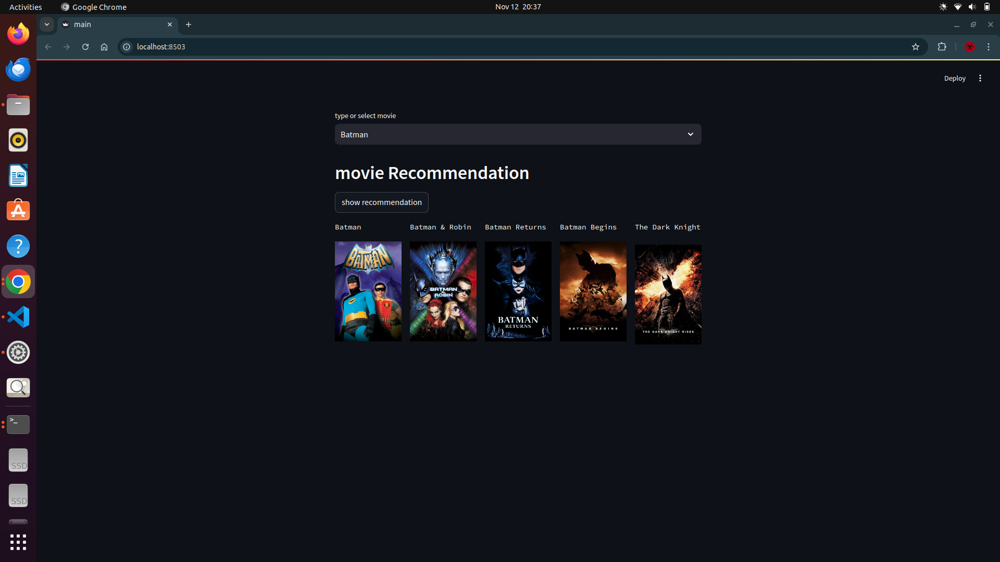

# Movie-Recommendation

## Content-Based Movie Recommendation System

To build a content-based movie recommendation system, we use `CountVectorizer` to transform selected text features (such as genres, cast, and keywords) into a matrix of token counts, where each movie is represented by a vector of its word frequencies. We then apply cosine similarity to this vectorized data to calculate similarity scores between movies. Cosine similarity measures the angle between vectors, indicating how closely related the movies are based on shared content. Using this similarity matrix, we can recommend movies that are most similar to a given movie, effectively leveraging the content without needing user preferences.

